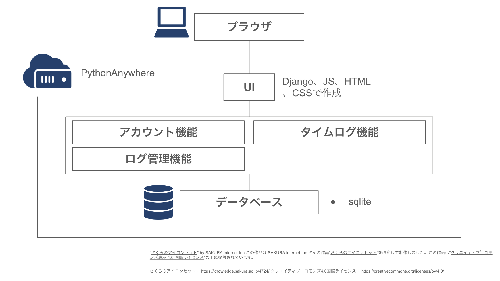

# Django-Library-Time-Logging-Webapp（図書室時間記録webアプリ）

## システム構成


## ファイル構成
```
library_time_log/
├── time_log/
│   ├── accounts/
│   │   ├── templates/
│   │   │   ├── accounts/
│   │   │   │   └── user_page.html
│   │   │   └── registration/
│   │   │       ├── login.html
│   │   │       └── signup.html
│   │   ├── __init__.py
│   │   ├── admin.py
│   │   ├── apps.py
│   │   ├── forms.py
│   │   ├── models.py
│   │   ├── tests.py
│   │   ├── urls.py
│   │   └── views.py
│   ├── management/
│   │   ├── templates/
│   │   │   └── management/
│   │   │       ├── analysis.html
│   │   │       ├── index.html
│   │   │       ├── lsit.html
│   │   │       └── download.html
│   │   ├── __init__.py
│   │   ├── admin.py
│   │   ├── apps.py
│   │   ├── forms.py
│   │   ├── models.py
│   │   ├── tests.py
│   │   ├── urls.py
│   │   └── views.py
│   ├── static/
│   │   ├── css/
│   │   │   ├── style_manager.css
│   │   │   └── style.css
│   │   ├── img/
│   │   │   ├── barchart.png
│   │   │   ├── download.png
│   │   │   ├── home.png
│   │   │   ├── icon.png
│   │   │   ├── list.png
│   │   │   ├── logout.png
│   │   │   └── user.png
│   │   ├── js/
│   │   │   └── script.js
│   ├── templates/
│   │   ├── base_manager.html
│   │   └── base.html
│   ├── time_log/
│   │   ├── __init__.py
│   │   ├── asgi.py
│   │   ├── urls.py
│   │   ├── wsgi.py
│   │   └── settings.py
├── time_logging/
│   ├── templates/
│   │   └── time_logging/
│   │       ├── exit_do.html
│   │       ├── exit.html
│   │       ├── forms.html
│   │       ├── index.html
│   │       ├── message.html
│   │       └── use.html
│   ├── __init__.py
│   ├── admin.py
│   ├── apps.py
│   ├── forms.py
│   ├── models.py
│   ├── tests.py
│   ├── urls.py
│   └── views.py
├── .gitignore
├── manage.py
└── README.md
```